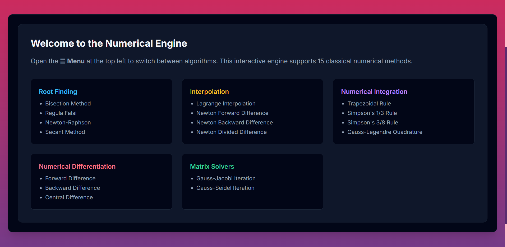

# Numerical Analysis Toolkit

**🌐 Live Web Portal:** [https://adrishmandal27.github.io/numerical_analysis/](https://adrishmandal27.github.io/numerical_analysis/)



A high-performance computational suite implementing 15 classical numerical methods. Originally built as a modular Java library and CLI, the project now features a complete, interactive **Web-Based Portal** powered by a JavaScript math engine and a custom-designed user interface.

---

## 📌 Features

### 1. Root-Finding Algorithms
* **Bisection Method:** Brackets roots using binary interval bisection.
* **Regula Falsi (False Position):** Linear interpolation-based root finding.
* **Newton-Raphson Method:** Fast quadratic convergence using first-order derivatives.
* **Secant Method:** Finite-difference approximation of Newton's method without direct derivatives.

### 2. Interpolation & Approximation
* **Lagrange Interpolation:** Computes exact polynomial fits for non-uniformly spaced data.
* **Newton Forward Difference:** Polynomial interpolation for equally spaced tabular data from initial nodes.
* **Newton Backward Difference:** Polynomial interpolation tailored for points near the end of tabular data.
* **Newton Divided Difference:** General divided difference scheme for arbitrary node spacing.
* **Linear Interpolation:** Basic linear estimation between bounding nodes.

### 3. Numerical Integration & Calculus
* **Trapezoidal Rule:** First-order composite Newton-Cotes quadrature.
* **Simpson's 1/3 Rule:** Quadratic parabolic approximation over uniform sub-intervals.
* **Simpson's 3/8 Rule:** Cubic approximation for enhanced accuracy over 3n intervals.
* **Gauss-Legendre Quadrature:** High-precision orthogonal polynomial root-weight evaluation.
* **Numerical Differentiation:** Forward and backward finite difference approximations for first and second derivatives.

### 4. Linear Matrix Solvers
* **Gauss-Jacobi Iteration:** Parallel iterative solver for strictly diagonally dominant linear systems.
* **Gauss-Seidel Iteration:** Successive-displacement accelerated linear system solver.

---

## 🎨 Web Portal Features
* **Custom User Interface:** Features a deep purple/gradient aesthetic with a responsive, sliding sidebar navigation system.
* **Interactive Computations:** Instantly calculates and generates dynamic HTML tables for iteration logs, difference tables, and matrix solver steps.
* **Client-Side Execution:** The entire mathematical engine runs locally in the browser via JavaScript, requiring no backend server.
* **Portal Integration:** Includes custom-designed pages for User Registration, Notice Boards, Test Dates, and a Lock Screen.

---

## 🏗 Project Structure

```text
numerical-analysis/
├── Web_Portal/
│   ├── index.html            # Main Math Engine & Dashboard
│   ├── HomeB.html
│   ├── RegisterB.html
│   ├── PracticeB.html
│   ├── LockB.html
│   ├── NoticeB.html
│   └── (Additional UI image assets)
├── Java_CLI/
│   ├── pom.xml
│   ├── numerical_analysis-main.jar
│   └── src/
│       └── main/
│           └── java/
│               └── com/
│                   └── numerical/
│                       ├── Main.java
│                       ├── Root_Finding/
│                       ├── Interpolation/
│                       ├── Numerical_Integration/
│                       ├── Numerical_Differentiation/
│                       └── Matrix/